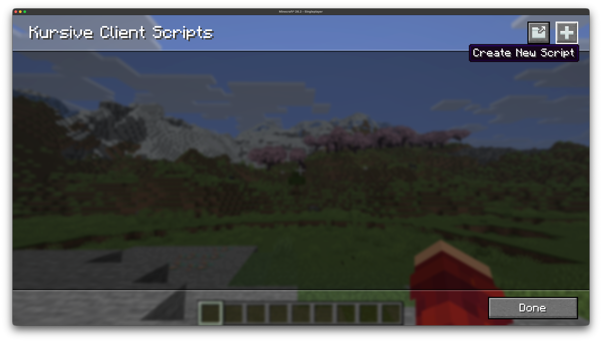
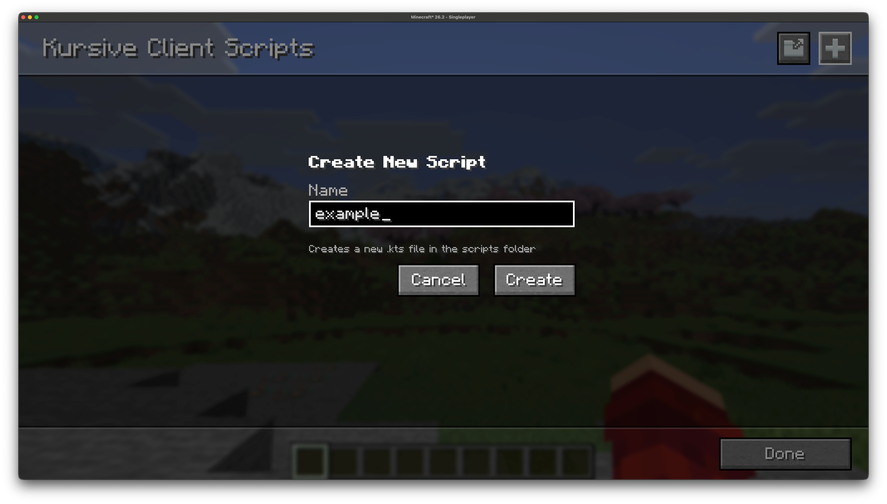
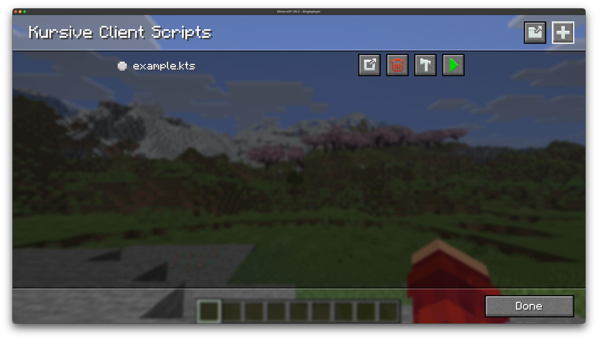

# Creating a Script

The easiest way to create a new script is via the in-game gui, there will be
a button to create a new script in both the client and server scripts gui.
To create a server script you must either be in singleplayer, or you must have
the `kursive.remote.create` permission on a dedicated server.


Clicking the button opens up a modal prompting you to name the script:


Enter a valid name, then hit the "Create" button, and the script will be created.
The script will generate with a template containing the basic entrypoint
and boilerplate to get you started. The script will then appear in your
scripts list:


Alternatively you can create a script without the gui, you need to locate the 
`kursive/scripts` directory. For a server-side script, find this directory in 
your world folder (this also applies for singleplayer), and to create a client-side 
script it will be in your `.minecraft` directory.

Create a new file in the scripts directory named `<name>.main.kts`, 
for example: `test.main.kts`.

## Script Entrypoint

A basic entrypoint script for a server-side script is as follows:
```kts
@file:DependsOn("me.senseiwells:kmc:0.3.0-alpha.1+26.2")

import kotlinx.coroutines.awaitCancellation
import me.senseiwells.kursive.api.ServerScriptContext
import net.minecraft.server.MinecraftServer

suspend fun main(server: MinecraftServer, context: ServerScriptContext) {
    awaitCancellation()
}
```

And for the client-side:
```kts
@file:DependsOn("me.senseiwells:kmc:0.3.0-alpha.1+26.2")

import kotlinx.coroutines.awaitCancellation
import me.senseiwells.kursive.api.ClientScriptContext
import net.minecraft.client.Minecraft

suspend fun main(minecraft: Minecraft, context: ClientScriptContext) {
    awaitCancellation()
}
```

If you are experienced with mod development you can in theory start writing code as you normally
would from this entrypoint. But in practice since scripts have a finite lifecycle and can be
started and stopped at will we want to avoid registering global state, as that will persist
even after the script has stopped. Ideally anything that our script does should be cleaned up
when the script is stopped. This'll be discussed further in later sections.

## Script Metadata

In addition to the `@file:DependsOn` annotation we can also annotate our script with `@file:KursiveScript`:
```kts
@file:KursiveScript(
    id = "example", 
    version = "1.0.0", 
    auto = false, 
    type = "client", 
    minecraft = "=26.2"
)
```
This lets you define the following:
- a script identifier (typically the same as the filename)
- the version of the script, this should follow [SemVer](https://semver.org/)
- whether the script should automatically run on client/server startup
- whether the script is for the client/server,
- a version predicate to indicate which versions of Minecraft the script is intended for, see [jubianchi's Semver check](https://jubianchi.github.io/semver-check/#/)