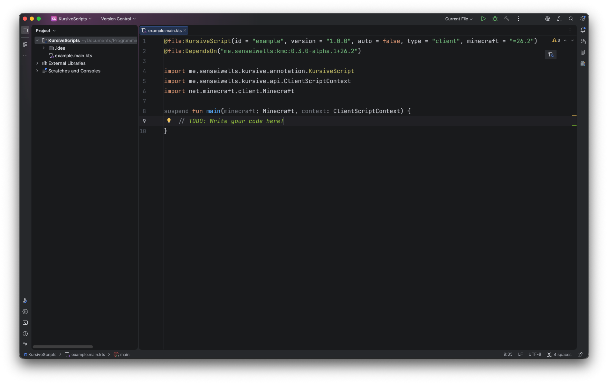

# Getting Started with Scripting

This section will cover how to set up the environment to start
developing scripts locally.

## Environment

While scripts can be opened in any text editor, it's highly recommended that you
use [IntelliJ](https://www.jetbrains.com/idea/) as it has first class support
for kotlin scripts, and provides complete syntax highlighting and autocomplete.



We use a dependency to get IntelliJ to properly index the Minecraft code and Kursive apis.
This dependency can't be distributed as it contains Minecraft code so you will need to
generate it locally for IntelliJ to index it properly.

Generating the dependency is relatively simple, first we need to clone the Kursive repo,
and then we just need to run a simple gradle command:

You will need Java 25 on your machine.

1. Clone the repo
   ```sh
   git clone https://github.com/senseiwells/Kursive.git
   ```
2. Generate the dependency jar, this will publish to maven local
   ```sh
   gradlew publishKmc
   ```

IntelliJ should automatically detect and find the dependency and should provide highlighting
for your script. You can check whether the dependency was successfully generated by checking
that `~/.m2/repository/me/senseiwells/kmc/0.3.0-alpha.1+26.2` exists.

Once you have IntelliJ set up and the dependency generated you are all set to start creating scripts!