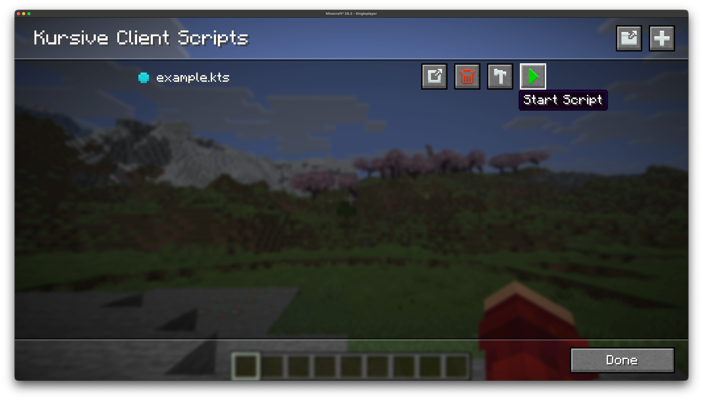
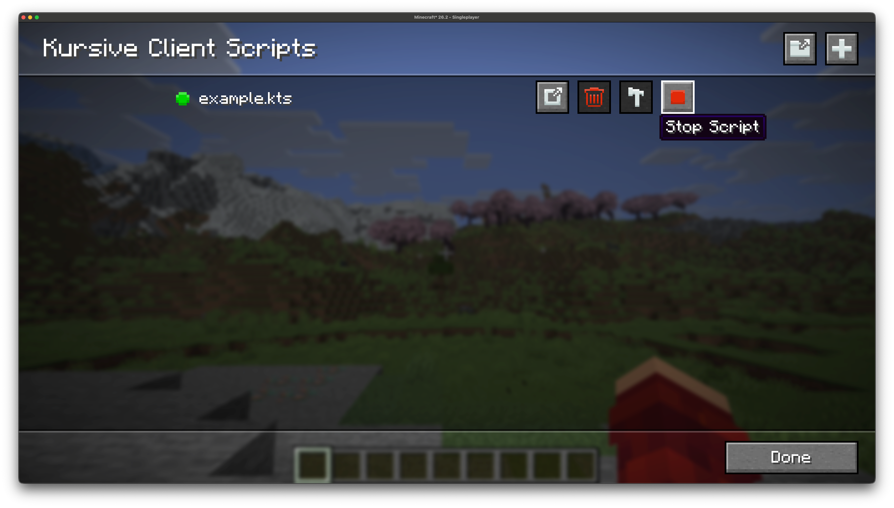
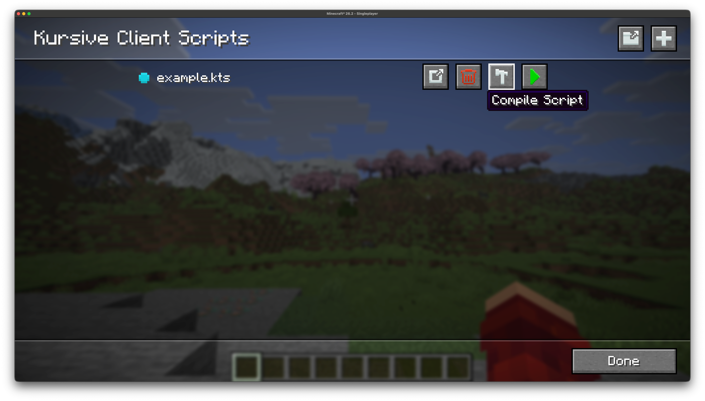
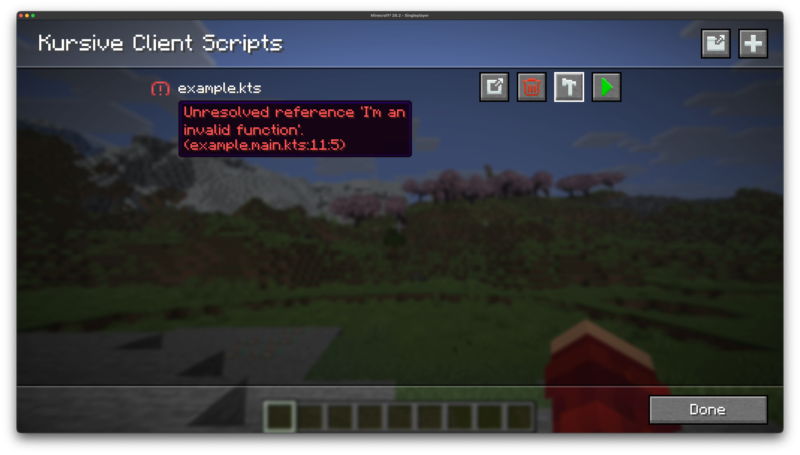

# Running Scripts

After you have created or downloaded a script and put it in your scripts directory you
are ready to compile and run the script. The easiest way to do this is via the in-game
gui, but there's also the option to run scripts via commands.

To access the in-game gui you can either go through [Mod Menu](https://modrinth.com/mod/modmenu)
or you can set a keybind for "Open Kursive Menu" in the controls screen. 
From here you can access the client scripts list and the server scripts list.

<!--@include: ../../README.md{47,53}-->

## Toggling Scripts

To run a script you can simply press the "Start Script" button. This will automatically
compile your script for you, and it will only recompile your script if it has been modified
since the last time it was compiled. If the script is valid and successfully compiled
it will start running.



After your script starts running (if it doesn't finish running instantaneously) the 
"Start Script" button will turn into the "Stop Script" button. You can press this
to stop the script from running.



## Compiling Script

You can manually (re)compile your scripts using the "Compile Script" button.
This is typically useful if you just want to check whether a script compiles:



## Diagnostics

The diagnostic indicator to the left of the script filename provides information
about the current status of the script. The list of statuses are as follows:
- **Grey**: Script has not been compiled
- **Blue**: Script has been successfully compiled
- **Green**: Script is currently running
- **Yellow (!)**: Script has been successfully compiled but with warnings
- **Red (!)**: Script failed to compile

The **(!)** indications also provide additional information about the warnings or errors:



## Commands

You may prefer to start your scripts via commands instead, or if you are running Kursive 
on the server but do not have it installed on your client you will need to run scripts
via the command.

To start a script you can run the commands below for the client and server respectively:
```mcfunction
/kursive-client start <script-name> <args?>
/kursive-server start <script-name> <args?>
```

And to stop a script:
```mcfunction
/kursive-client stop <script-name>
/kursive-server stop <script-name>
```
